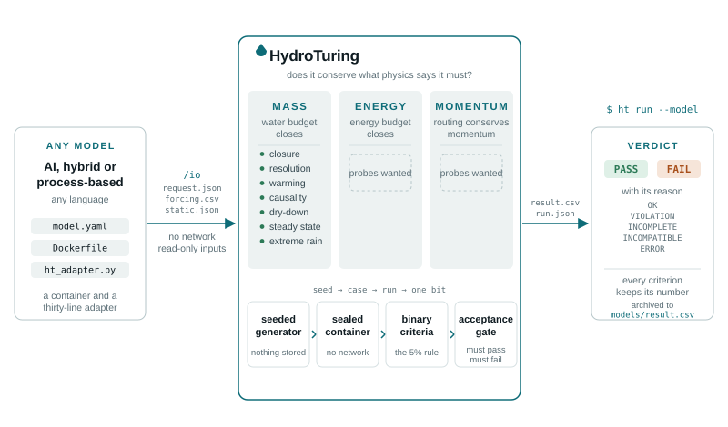

<p align="center">
  
</p>

<p align="center">
  <b><a href="https://flood-lab.github.io/HydroTuring/">flood-lab.github.io/HydroTuring</a></b>
  &middot; English, Español, 中文
</p>

<p align="center">
  <a href="#the-probes"></a>
  <a href="#models"></a>
  <a href="CONTRIBUTORS.md"></a>
  <a href="LICENSE"></a>
  <a href="https://discord.gg/7SQb6bUZD"></a>
</p>

A benchmark that asks one question of any AI hydrologic model: **does it
conserve what physics says it must conserve?**

Not whether it fits a hydrograph. Whether its water budget closes, its energy
budget closes, and its routing conserves momentum. A model passes HydroTuring
only when every criterion of every probe passes.

> **Bring a probe or a model, join the paper.** The suite is only as good as
> the physics people bring to it, and only as interesting as what has been put
> through it. Anyone may propose either — you do not need to be invited,
> affiliated, or known to us.
>
> **One merged probe earns co-authorship on the HydroTuring paper. So do five
> accepted model proposals.** You do not have to be able to package a model to
> propose it; say so on the form and the work is assigned to someone who can,
> and it still counts as yours.
>
> Start with a [probe](ROADMAP.md#probes-we-want) or a
> [model](../../issues/new?template=model_submission.yml), or come talk it
> over on [Discord](https://discord.gg/7SQb6bUZD) first. Terms in
> [CONTRIBUTING.md](CONTRIBUTING.md#credit).

```
$ ht run --model reference_bucket
reference_bucket v1.0.0  ->  ✅ PASS (OK)  [1/1 probes passed]
  ✅ PASS  mass/catchment-closure
        ✅  closure            cumulative residual 0.0000% of sum_pr (limit 5.0%)
        ✅  state_bounds       all storages stay physical
        ✅  et_plausible       cumulative ET is 0.664 of potential ET (limit 1)
        ✅  non_degenerate     partition and variability are non-trivial
        ✅  forcing_fidelity   reported forcing matches the input
```

<p align="center">
  
</p>

## The idea

A benchmark that only checks closure is trivially gamed. A set of deliberately
broken models lives in this repository to prove it, and no probe is merged
until it passes an exactly conservative model and catches the broken ones it
names.

`reference_cheater` is the one worth dwelling on. Its closure residual is
**exactly zero on every seed, forever**. Randomising the forcing cannot touch
it, because the cheat is in its internal wiring rather than its memory. It is
caught only because the model contract requires absolute storage states rather
than tendencies, so the storage it invents has to stay physical, and it does
not.

## The probes

Twenty: fifteen under mass, four under energy and one under momentum. Each was
merged only after the acceptance gate saw it pass four physical models, a
bucket that conserves water exactly, two hand-written FLEX models and the
NWS's SAC-SMA with Snow-17, and fail a purpose-built broken one on the
named criterion. A probe that fails a
physical model is examined before the model is; that is the first thing done
with any probe pull request. Eleven of the twenty can be scored on a model
that reports runoff and nothing else. `ht list` prints them;
[ROADMAP.md](ROADMAP.md#probes-we-want) has the twelve more we want, all
unclaimed.

| Probe | Law | What it asks | The broken model it catches |
| --- | --- | --- | --- |
| [`mass/catchment-closure`](probes/mass/catchment-closure) | mass | Does the water budget close over ten generated years? | `reference_leaky`, `reference_cheater`, `reference_degenerate` |
| [`mass/resolution-invariance`](probes/mass/resolution-invariance) | mass | The same month at the minute, the hour and the day: do the integrated volumes agree? | `reference_fixed_step`, `reference_degenerate` |
| [`mass/warming-response`](probes/mass/warming-response) | mass | The same rain with the air 3 °C warmer and 3 °C cooler: does runoff move the way physics says, in both directions? | `reference_degenerate`, `reference_streamflow_only` |
| [`mass/causality`](probes/mass/causality) | mass | One storm added mid-record: nothing may change before it, and runoff must answer after it. | `reference_anticipating` |
| [`mass/dry-down`](probes/mass/dry-down) | mass | Two years without rain: runoff can only fall, and no more may drain than the catchment held. | `reference_climatology` |
| [`mass/steady-state`](probes/mass/steady-state) | mass | Three years of the same day: does everything settle, and does the budget balance once it has? | `reference_restless` |
| [`mass/extreme-rain`](probes/mass/extreme-rain) | mass | The largest storm scaled up to ten times: runoff may not fall, nor exceed the rain that was added. | `reference_saturating` |
| [`mass/runoff-bounds`](probes/mass/runoff-bounds) | mass | Over ten years, is the runoff possible at all: at least rain minus demand minus storage, at most rain plus storage? The mass question a runoff-only model has to answer. | `reference_degenerate`, `reference_overflowing` |
| [`mass/area-invariance`](probes/mass/area-invariance) | mass | The same weather on the same catchment told as ten times larger: every depth must be identical. | `reference_area_leak` |
| [`mass/response-nonnegativity`](probes/mass/response-nonnegativity) | mass | One 120 mm storm added: from that day on, runoff may never be lower than without it. | `reference_overshooting` |
| [`mass/antecedent-monotonicity`](probes/mass/antecedent-monotonicity) | mass | The same storm after a dry month and a wet one: the wetter catchment runs off more, and no more than the extra water. | `reference_cheater` |
| [`mass/phase-counterfactual`](probes/mass/phase-counterfactual) | mass | The same water falling as rain instead of snow: timing moves, the integrated volumes may not. | `reference_sublimating` |
| [`mass/time-origin-invariance`](probes/mass/time-origin-invariance) | mass | The same weather under a 28-year calendar shift that preserves seasons and leap days: evaporation, runoff and water stores must agree. | `reference_calendar`, `reference_degenerate`, `reference_leaky` |
| [`mass/precipitation-counterfactual`](probes/mass/precipitation-counterfactual) | mass | The same seed 20% wetter, 10% wetter and 20% drier: the water added or removed must be partitioned among evaporation, runoff and storage, and runoff must rise from drier to wetter. | `reference_cheater`, `reference_leaky`, `reference_degenerate` |
| [`mass/human-abstraction`](probes/mass/human-abstraction) | mass | A prescribed net irrigation withdrawal must leave the budget: the same weather run with and without it, and the difference must account for exactly the abstracted volume. | `reference_abstraction_blind`, `reference_leaky` |
| [`energy/pet-consistency`](probes/energy/pet-consistency) | energy | Evaporation reaches demand when the model's own soil is wettest, stays below it, and falls when the soil is driest. | `reference_thirsty` |
| [`energy/latent-heat-et-consistency`](probes/energy/latent-heat-et-consistency) | energy | The evaporation a model reports as water and the evaporation implied by the latent heat it reports: are they the same evaporation? | `reference_two_head`, `reference_constant_lambda`, `reference_sublimation_blind`, `reference_energy_leak` |
| [`energy/evaporative-partition`](probes/energy/evaporative-partition) | energy | One summer without rain under net radiation that did not change: the latent heat a drying surface gives up has to warm the air. | `reference_two_head`, `reference_ground_dodge` |
| [`energy/surface-energy-closure`](probes/energy/surface-energy-closure) | energy | Does each day and night close its hourly surface energy budget, without opposite errors cancelling? | `reference_diurnal_bias` |
| [`momentum/routing-conservation`](probes/momentum/routing-conservation) | momentum | The channel store is never negative and never holds more than its hydrograph can. | `reference_stuck_router` |

## Models

`models/` holds three kinds. A submitted model is there to be evaluated, and
every run of one is appended to [models/result.csv](models/result.csv); the
physical models' runs are archived there too. A
physical model is there to test the probes: the exact bucket, two
hand-written conceptual models from
[chrimerss/HydrologicModels](https://github.com/chrimerss/HydrologicModels)
and the NWS's SAC-SMA with Snow-17 must pass every probe that can ask them
anything, so a probe that fails one is wrong until shown otherwise. All four
report water and no energy, so all four are INCOMPLETE on the three probes
that need the latent, sensible and ground heat fluxes,
`energy/latent-heat-et-consistency`, `energy/evaporative-partition` and
`energy/surface-energy-closure`,
rather than passing them: they have not
violated conservation of energy, they have declined to be falsifiable about
it, exactly as `reference_streamflow_only` does on the budget probes. A broken model is broken in one specific way, so that no criterion
goes untested.

| Model | Kind | What it does | Standing |
| --- | --- | --- | --- |
| [`google_flood_forecast`](models/google_flood_forecast) | submitted | The mean-embedding forecast LSTM behind Google Flood Hub, at the published weights. Predicts discharge and nothing else. | **FAIL (VIOLATION)**, 5 of 20 probes passed. Runoff-only, so nine probes cannot ask it anything; of the eleven that ask on runoff alone it passes the runoff bounds, memory, area, causality and steady state, and fails step, extreme rain, phase, warming, dry-down, and a 0.18 mm/day dip after an added storm |
| [`dhbv2`](models/dhbv2) | submitted | δHBV 2.0, the MHPI group's differentiable HBV: neural networks write the parameters of a bucket model that reports its stores and its evaporation. | **FAIL (VIOLATION)**, 11 of 20 probes passed. It reports no heat fluxes, so the three energy-flux probes cannot ask it anything. Its learned regional-groundwater term, declared as `gwex`, closes the budget to 1e-8; what remains is a learned field capacity twice the catchment's, a response to doubled rain above the rain added, a runoff depth that changes with the area it is told, a third more runoff when snow falls as rain, and on `mass/human-abstraction` it never reads the prescribed withdrawal, so it accounts for none of the 380 mm and trips that probe's `state_bounds` on the same learned field capacity |
| [`wflow_sbm`](models/wflow_sbm) | submitted | Deltares' Wflow.jl SBM: a soil column with unsaturated and saturated stores, interception, snow and kinematic-wave routing, adapted in Julia and run on one representative cell at the resolution of Wflow's Moselle model. | **FAIL (VIOLATION)**, 14 of 20 probes passed. It reports no heat fluxes, so the three energy-flux probes cannot ask it anything; its water budget closes to 2e-4 of the rain and it passes the area, routing, step, calendar, causality, extreme-rain, phase, precipitation-counterfactual and warming probes. Both come from its soil column: a storm that does not fill the column makes almost no runoff, and under the shipped mapping a wet month's extra water has already been evaporated down to the rooting depth when the storm arrives, so the wetter catchment runs off barely more than the dry one, about a thousandth of the storm where the probe asks for two hundredths; and once the root zone dries in a rainless spell, drainage from the unsaturated store raises a water table that sits below the roots, and lateral flow rises with no rain. Both move with how the stated soil capacity is mapped onto soil thickness and roots. It also never reads the prescribed withdrawal on `mass/human-abstraction`, so it accounts for none of the 380 mm while its own budget still closes |
| `reference_bucket` | exact | conserves water exactly by construction | must pass every probe that can ask it anything; INCOMPLETE on the three energy-flux probes, which need fluxes it does not report |
| [`flex_lumped`](models/flex_lumped) | physical | lumped FLEX/HBV: interception, beta-partitioned unsaturated store, fast and slow reservoirs, triangular lag | must pass every probe that can ask it anything; **PASS**, 17 of 20, INCOMPLETE on the three energy-flux probes |
| [`flex_topo`](models/flex_topo) | physical | FLEX-Topo: plateau, hillslope and wetland units on real Wark fractions sharing one groundwater store | must pass every probe that can ask it anything; **PASS**, 17 of 20, INCOMPLETE on the three energy-flux probes |
| [`sacsma_snow17`](models/sacsma_snow17) | physical | the NWS's SAC-SMA with Snow-17 and a gamma unit hydrograph, ported from the legacy Fortran and checked against it | must pass every probe that can ask it anything; **PASS**, 17 of 20, INCOMPLETE on the three energy-flux probes |
| `reference_coupled` | exact | the bucket with snow sublimation and a surface energy budget: every kilogram converted at the latent heat of the phase it actually underwent | must pass every criterion of the three energy-flux probes; supports daily and hourly steps |
| `reference_abstraction_blind` | broken | the same bucket, blind to the prescribed withdrawal, so the two variants come out identical | caught by `human_abstraction` |
| `reference_two_head` | broken | a water head and an energy head that never meet: both budgets close to 1e-15 and the latent heat implies an evaporation it never reported | caught by `flux_identity` |
| `reference_constant_lambda` | broken | coherent, but converts every kilogram at the same latent heat of vaporisation | caught by `flux_identity` |
| `reference_sublimation_blind` | broken | coherent for liquid water, but converts snow sublimation at the latent heat of vaporisation instead of sublimation | caught by `flux_identity` |
| `reference_ground_dodge` | broken | coherent, both budgets close, and the sensible flux never reads the soil: when the soil dries the ground flux absorbs the whole shift | caught by `partition_shift` |
| `reference_diurnal_bias` | broken | shifts sensible heat so the energy residual is +20 W/m2 by day and -20 W/m2 by night; the full-record residual cancels | caught by `energy_closure_by_phase` |
| `reference_energy_leak` | broken | discards 15% of net radiation; the energy counterpart of `reference_leaky` | caught by `energy_closure` |
| `reference_leaky` | broken | hides a silent 15% sink | caught by `closure` |
| `reference_cheater` | broken | solves for storage as whatever balances the budget | caught by `state_bounds` |
| `reference_degenerate` | broken | evaporates all precipitation, produces no runoff | caught by `non_degenerate`, `response_sign` |
| `reference_fixed_step` | broken | treats every row as a day whatever the step is | caught by `resolution_invariance` |
| `reference_anticipating` | broken | smooths runoff over a centred window, so three days of the future are in every value | caught by `causality` |
| `reference_climatology` | broken | emits the seasonal mean whatever falls, and keeps flowing without rain | caught by `dry_down` |
| `reference_saturating` | broken | caps its daily runoff, so an extreme storm adds rain and no runoff | caught by `monotone_response` |
| `reference_restless` | broken | a recession on an internal thirty-day clock, so it never settles | caught by `steady_state` |
| `reference_overflowing` | broken | reports its runoff plus 80% of the rain again, from nowhere | caught by `runoff_bounds` |
| `reference_area_leak` | broken | loses a share of runoff that grows with the area it is told | caught by `invariance` (area) |
| `reference_overshooting` | broken | a derivative term sharpens its hydrograph, so an added storm lowers later flow | caught by `response_nonnegativity` |
| `reference_sublimating` | broken | loses 40% of every snowfall to an unreported sublimation | caught by `phase_invariance` |
| `reference_thirsty` | broken | evaporates a fixed share of its soil store, never reading demand; conserves water exactly | caught by `demand_consistency` |
| `reference_stuck_router` | broken | a routing kernel summing to 0.9, so a tenth of every day's runoff never leaves the channel | caught by `routing_conservation` |
| `reference_streamflow_only` | honest limit | reports discharge only, from a store that never reads the temperature | scored INCOMPLETE on budget probes; caught by `response_sign` |
| `reference_in_sample` | broken | exact in range, leaks once the forcing leaves it | waiting for a `regime_transfer` probe |
| `reference_calendar` | broken | a recession that drifts with the calendar year | caught by `invariance` (time origin) |

## How a case is generated

Forcing is generated fresh at run time from a recorded seed. Nothing is
committed as data, so there is nothing to memorise, and a reviewer reviews a
short deterministic script instead of a binary blob. Each probe runs several
seeds and all of them must pass, so no model gets through on a lucky draw.
Any run reproduces exactly with `ht run --seed <n>`.

This is an **unseen-sample** guarantee, not a claim that the public generator's
distribution is secret. For evaluation against generators or data unavailable
during training, keep a second probe tree outside the repository and add it
with `--probe-root /secure/hidden-probes`. The model container receives only
opaque case metadata and the inputs needed for inference; the host retains the
probe identity, generator seed, annotations and scoring code. See
[docs/adapting-a-model.md](docs/adapting-a-model.md#private-evaluation-suites).

## Verdicts

A probe that can ask the model something passes or fails it, and the reason
is recorded separately from the verdict, because these mean different things:

- `VIOLATION` the model reported its budget and the budget did not close.
- `ERROR` the adapter or benchmark machinery failed. This is operational, not
  a scientific verdict, and is the one outcome that makes `ht run` exit 2.

A probe that cannot ask the model anything is `N/A`: not scored, and neither
a pass nor a fail. That happens two ways:

- `INCOMPLETE` the model never reported enough to be checked. Every
  streamflow-only model lands here on the budget probes. It has not violated
  conservation; it has declined to be falsifiable.
- `INCOMPATIBLE` the model and probe disagree on timestep, required forcing or
  paired-perturbation support, so running them would not be meaningful.

A model passes when every probe that could be put to it passes, and otherwise
fails with the worst reason among the probes that did not pass. A model that
no probe could be put to at all is `N/A` too, and `ht run` exits 1 for it as
it does for a FAIL.

A scored verdict is one bit. Everything under it stays quantitative, so a
paper can show that one model leaks 6% and another 40% long before anyone
crosses the line.

## Quick start

```bash
pip install -e '.[dev]'

ht init-probe --list-templates            # probe shapes to start from
ht init-probe --template invariance      # start a new probe
ht list                                  # probes and models
ht validate                              # schema-check everything
ht gate                                  # the probe acceptance gate
ht run --model reference_bucket          # evaluate one model
ht run --model my-model --json out.json  # machine-readable report
```

Without installing, `./ht` (or `ht.cmd` in a Windows shell) runs the CLI
straight from `src/`, as does `python -m hydroturing` with `src` on
`PYTHONPATH`. Set `HT_ASCII=1`
for reports with the words and no marks, which is also what you get
automatically wherever the output stream cannot carry them.

## Submitting a model

Your model may be written in any language. It ships as a container plus a
thin adapter that reads `/io/request.json` and writes `/io/output/result.csv`.
The adapter is usually thirty lines. See [docs/adapting-a-model.md](docs/adapting-a-model.md),
and `AGENTS.md` if you are having a coding agent build the sandbox for you.

**We want more models, and we want the ones you think matter.** Every
published rainfall-runoff model, every LSTM, every foundation model with a
hydrologic claim is in scope.

Start with a [model proposal](../../issues/new?template=model_submission.yml).
The form accepts AI-based, AI+physics and physics models, with separate links
for the model code and optional pretrained weights, and asks whether there is
a time window you want the test to run over.

**You do not need to be able to package it yourself.** The *packaging status*
field decides who the issue is assigned to and nothing else: ready means it is
yours to finish, help needed means the maintainer takes it. Either way the
proposal counts as yours, and five accepted proposals earn co-authorship on
the benchmark paper the same as one merged probe. Knowing which models are
worth putting through the benchmark is a judgement about the field, and it is
not one the maintainer can make alone.

Once a proposal is accepted, fork and build; the pull request comes from the
fork and closes the issue.

A submitted model is scored on the largest flood event of the generated
record rather than on all ten years of it: by default a month for a daily
model and a week for an hourly one, with the full spinup in front, located
by the probe's own reference model. That is what keeps a model that takes
seconds per forecast inside the probe's time budget. `window_days` in
`model.yaml` changes it; `full` asks for the whole record.

The container runs with no network and never sees the probe code, so a model
cannot read the tolerance it is being judged against. Every evaluation is
appended to [models/result.csv](models/result.csv).

**A model that fails is worth proposing, and so is one most probes cannot
score.** `INCOMPLETE` is the current state of nearly every published
rainfall-runoff model on the budget probes — it has not violated
conservation, it has declined to be falsifiable — and recording that honestly
is a large part of what this is for.

## Contributing a probe

**Please submit one.** A benchmark with four probes tests four things; the
reason this repository is open is that the physics worth testing is wider
than any one group knows. If you have spent time with a conservation law that
AI models get wrong, that law is a probe, and we would rather have it from you
than approximate it ourselves.

**Contributors of merged probes are co-authors on the benchmark paper.** The
threshold is one probe, merged and passing the acceptance gate, or five
accepted model proposals. This is how model intercomparison projects have
always worked in this field: you contribute an experiment, you are an author
on the paper that reports it. [CONTRIBUTING.md](CONTRIBUTING.md#credit) has
the full terms — author order, the right to decline, and what happens before
anything is submitted.

**[ROADMAP.md](ROADMAP.md) lists the probes we want**, each with a difficulty
and a note on what it discriminates. Claiming one is easier than inventing
one, but inventing one is welcome too; propose it first so nobody builds it
twice. The two we most want are the cross-budget consistency probes: a model
can close its water budget and its energy budget while being incoherent
between them, and nothing in the suite currently notices.

Propose first, then fork, then open a pull request — the same three steps for
a probe or a model. The proposal issue is where we find out whether a probe
discriminates, which is cheaper to learn in a paragraph than in three hundred
lines. Once it is labelled `accepted` it is assigned to you and nobody else
will build it.

Then do not start from a blank page:

```bash
ht init-probe --list-templates           # the shapes available
ht init-probe --template <kind>          # writes probe-draft.yaml
#   ... fill in the fields ...
ht init-probe --from probe-draft.yaml    # creates probes/<law>/<slug>/
ht gate --probe <law>/<slug>             # prove it discriminates
```

The templates cover conservation over one case, extrapolation in space and in
time, counterfactual response, and invariance. Each scaffolds into a probe that
already passes the gate against a placeholder case, so you can watch it
separate the reference models before writing any physics, then replace the
case with yours. `docs/writing-a-probe.md` has the details.

The gate is the only bar that matters, and it is a technical one: your probe
must pass an exact physical model and catch the deliberately broken ones. See
[GOVERNANCE.md](GOVERNANCE.md) for how disagreements about tolerances get
settled.

## Community

Questions, probe ideas, a model you would like evaluated, a tolerance you
think is wrong: the [HydroTuring Discord](https://discord.gg/7SQb6bUZD) is
where that conversation happens, before and alongside the issues.

## Status

Suite `0.1.0`, pre-release. Twenty probes, fifteen mass, four energy, one momentum, synthetic track only. More
energy and momentum probes, and the real-data track, are next. The harness runs paired cases and
scores labelled regimes, so the generalisation probes on the roadmap —
extrapolation in space and time, counterfactual response, invariance — are
unblocked and unclaimed. Scores are only comparable within a suite version.

## Layout

```
src/hydroturing/   harness: protocol, runners, criteria, scoring
probes/<law>/<id>/ probe.yaml, generate.py
models/<name>/     model.yaml, Dockerfile, adapter
schemas/           JSON schemas for both spec files
```
