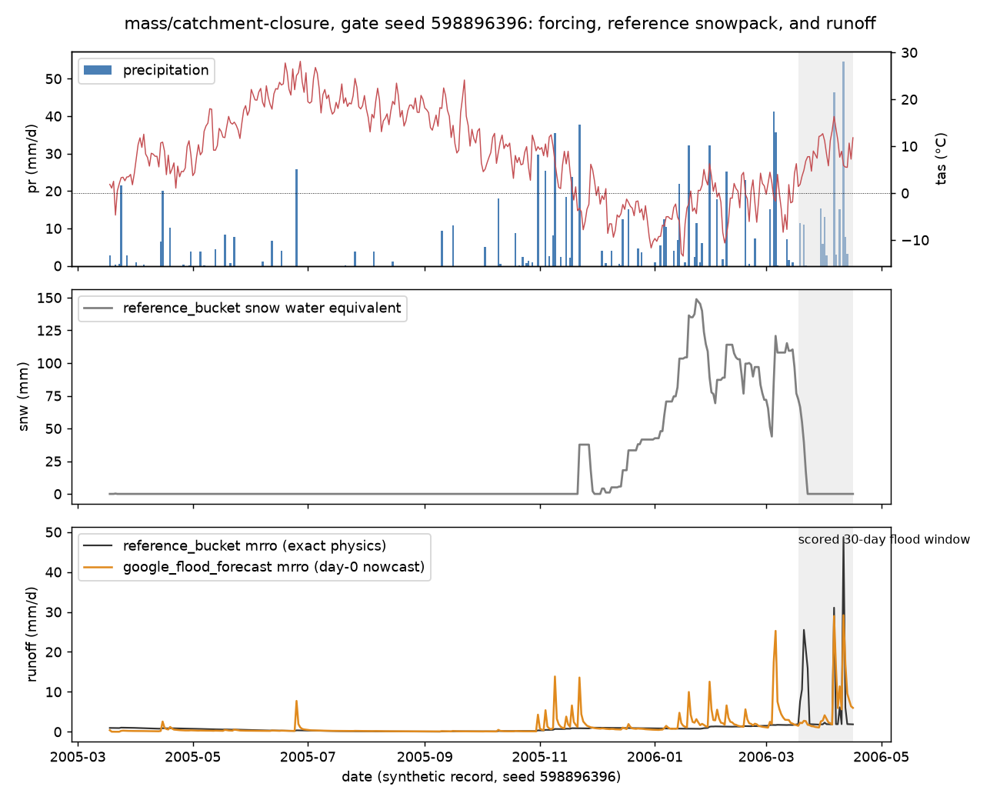

# google_flood_forecast

Google's operational flood forecasting model, as released in
[google-research/flood-forecasting](https://github.com/google-research/flood-forecasting)
(OpenHydroNet) at commit `828dfc5`, with the published
`google-floodhub-settings-55-epochs` weights. Architecture: the mean-embedding
forecast LSTM ([Gauch et al. 2025](https://hess.copernicus.org/articles/29/6221/2025/));
the lineage is [Nearing et al. 2024](https://doi.org/10.1038/s41586-024-07145-1).
Requested in [issue #1](https://github.com/Flood-Lab/HydroTuring/issues/1).

## What it emits

Streamflow, and nothing else. `mrro` is the model's own prediction in mm/day;
`dis` is that depth times the catchment area, in m3/s. There is no
evapotranspiration, no storage, and the adapter invents none, so on every
budget probe the verdict is **FAIL (INCOMPLETE)**: the model has not violated
conservation, it has declined to be falsifiable on it. That is the honest
outcome for every streamflow-only model, and the reason the report carries a
reason next to the verdict.

## How the probe's forcing reaches the model

The model was trained on four weather products (HRES, GraphCast, IMERG, CPC)
and 84 Caravan/HydroATLAS attributes. A probe hands it daily precipitation,
temperature and potential ET for one lumped catchment. The adapter maps one
onto the other without inventing inputs:

| Model input | Given |
| --- | --- |
| GraphCast, IMERG, CPC precipitation; GraphCast temperature | the forcing's `pr` and `tas`, standardised with each product's own training statistics |
| HRES (precipitation, temperature, net solar and thermal radiation, surface pressure) | marked missing as a whole product, because the probe cannot supply radiation or pressure. This is the model's own documented path for an absent product: product embeddings are combined with a NaN-aware mean |
| 14 climate attributes (`p_mean`, `pet_mean`, `aridity`, `frac_snow`, `moisture_index`, `seasonality`, high/low precipitation frequency and duration, annual P, PET, aridity index, mean temperature) | derived from the forcing the model is given, using Caravan's definitions |
| the other 70 attributes (land cover, terrain, soils, human footprint, ...) | the training mean, i.e. zero after standardisation, because a synthetic lumped catchment has no such properties |

Each day is its own forecast issue with a 365-day hindcast window, run from a
fresh state exactly as the operational model does. The reported value is the
day-0 member of that day's forecast: the prediction for the issue day given
everything up to and including it. Days early in the record use the history
that exists. The point prediction is the median of the model's own CMAL
mixture samples, seeded from the request so a case reproduces exactly.
`run.json` records all of this per run.

## Evaluation window

The submission asked for no particular window, so the manifest takes the
default for a daily model: the largest 30-day flood event of the record,
located by the probe's reference model, with the full spinup in front of it
(395 rows). One case takes about 20 s on 8 CPU cores; the full ten-year
record would take several minutes per seed and does not fit the probe's time
budget.

## Results (2026-09-03, suite 0.1.0)

| Check | Outcome |
| --- | --- |
| `ht verify-adapter` on `mass/catchment-closure`, gate seed 598896396 | contract OK: 395 rows in 21 s, columns `mrro`, `dis` |
| `ht run` on `mass/catchment-closure` | FAIL (INCOMPLETE): does not report `pr`, `evspsbl`, `mrso`, `snw`, `canopy` |

Archived in [`models/result.csv`](../result.csv).

What the model did on the event it was handed (seed 598896396, 2006-03-18 to
2006-04-16, the reference bucket's largest 30-day flood), from
[`event_window_seed598896396.csv`](event_window_seed598896396.csv):

| | precipitation | reference_bucket runoff | google_flood_forecast runoff |
| --- | --- | --- | --- |
| window total (mm) | 189 | 212 | 184 |
| peak (mm/day) | 55 | 49 | 29 |

Daily correlation with the exact model over the window is 0.65. The model
picks up every rain-driven peak with a realistic recession, under-predicts
the two largest, and produces runoff from winter precipitation that the
exact bucket stores as snow, then misses that snowpack's melt pulse in late
March. Whether the last two come from the missing HRES product, from the
attributes held at their training mean, or from the model itself is not
something this benchmark can say; it is the behaviour of the released model
under the inputs it was given.



## Reproduce

```bash
ht verify-adapter --model google_flood_forecast          # builds the image, ~20 s per case
ht run --model google_flood_forecast --gate-seeds        # INCOMPLETE, without starting the container
ht verify-adapter --model google_flood_forecast --window full   # full record; exceeds the 60 s budget
```

The image pins the source revision and the weight files; nothing is fetched
at run time.
